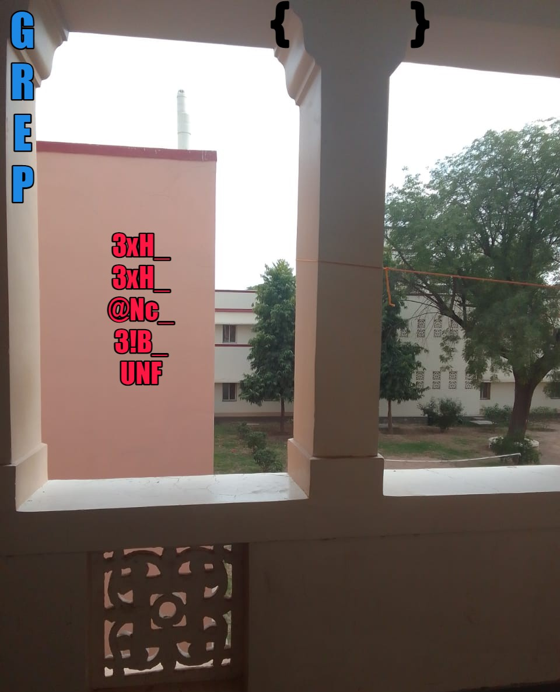

### Land of H3X

> DESCRIPTION - 
Morino Idate is on the run again. Uzumaki Xoruto has promised to help him and they reach Bits Pilani 😊. Ibiki is trapped by AOI in one of the bhawans but nobody knows which one. Help Morino meet his brother ! Anbu 🥷 members have got a secret scroll 📖 but they are unable to read it.

They say it's written by the shinobis of Land of H3X. 
Only info gathered yet is they use @ to denote 'a'. 
```
---
---
---
⠀⠀⠀⠀⠀⠀⠀⠀⠀⠀⣀⣤⣤⣤⣤⣤⣤⣀⡀⠀⠀⠀⠀⠀⠀⠀
⠀⠀⠀⠀⠀⠀⢀⣠⣶⣿⣿⡿⠿⠿⠿⠿⢿⣿⣿⣷⣦⣄⣀⣤⣶⣶
⠀⠀⠀⠀⠀⣰⣿⣿⠿⠋⠁⠀⠀⠀⠀⠀⠀⠀⠉⠛⠿⣿⣿⣿⠟⠋
⠀⠀⠀⠀⣼⣿⡿⠃⠀⢀⣤⣾⣿⣿⣿⣿⣷⣦⣄⠀⠀⠈⠉⠀⠀⠀
⠀⠀⠀⣸⣿⡿⠁⠀⢠⣿⣿⠟⠉⠀⠈⠉⠛⢿⣿⣷⡄⠀⠀⠀⠀⠀
⠀⠀⢀⣿⣿⡇⠀⠀⣾⣿⡟⠀⠀⢀⣤⣄⠀⠀⠹⣿⣿⡄⠀⠀⠀⠀
⠀⠀⣾⣿⣿⡇⠀⠀⢻⣿⣷⡀⠀⠘⣿⣿⡇⠀⠀⣿⣿⡇⠀⠀⠀⠀
⠀⣼⣿⡿⣿⣿⡄⠀⠈⠻⣿⣿⣷⣿⣿⡿⠃⠀⢀⣿⣿⡇⠀⠀⠀⠀
⣰⣿⣿⠁⠹⣿⣿⣦⡀⠀⠈⠉⠛⠋⠉⠀⠀⣠⣾⣿⡟⠀⠀⠀⠀⠀
⣿⣿⣧⣤⣤⣬⣿⣿⣿⣶⣦⣤⣤⣤⣴⣶⣿⣿⡿⠋⠀⠀⠀⠀⠀⠀
⠙⠿⠿⠿⠿⠿⠿⠿⠿⠿⠿⠿⠿⠿⠿⠛⠋⠁⠀⠀⠀⠀⠀⠀⠀⠀
Find where Ibiki is before the room catches fire !
```

> HINT : The bhawan used starts with an 's'

Author - `@ckc9759`

FLAG FORMAT: `GREP{...}`

---

### Solution 

This one was a mixture of a little bit of OSINT and forensics.

So you get a file which has hex code, if you put that on cyberchef and use `from hex`, you will get this :


The description uses word `Xoruto` which is a clear hint towards XOR operation and there was also mention of Bhawans and use of a as @.
Now there are not many bhawans in BIT Pilani.


We can eliminate some bhawans with no `a` such as `BUDH`.
If we keep trying the keys as bhawan names, we will find that shankar makes some sense. 


Since, a was to be used as @, the key is sh@nk@r.


Now, we get a file with headers as `BNG` and `MKDHIR` which are wrong and should be replace with `PNG` and `IHDR`.
You can read about it over [here](https://hackmd.io/@FlsYpINbRKixPQQVbh98kw/Bk9Wj63vH)

After using any online hex editor or the command `hexedit` in linux, we fix the above hex codes. Moreover, the desc talks abt idate and if u look closely IDAT chunk is 
written as IPAT and that should also be fixed.

If you fix all these correctly, an image will be rendered containing flag in jumbled words



---

Flag : GREP{H3x_H3x_c@N_B3!_FUN}

Thank you

